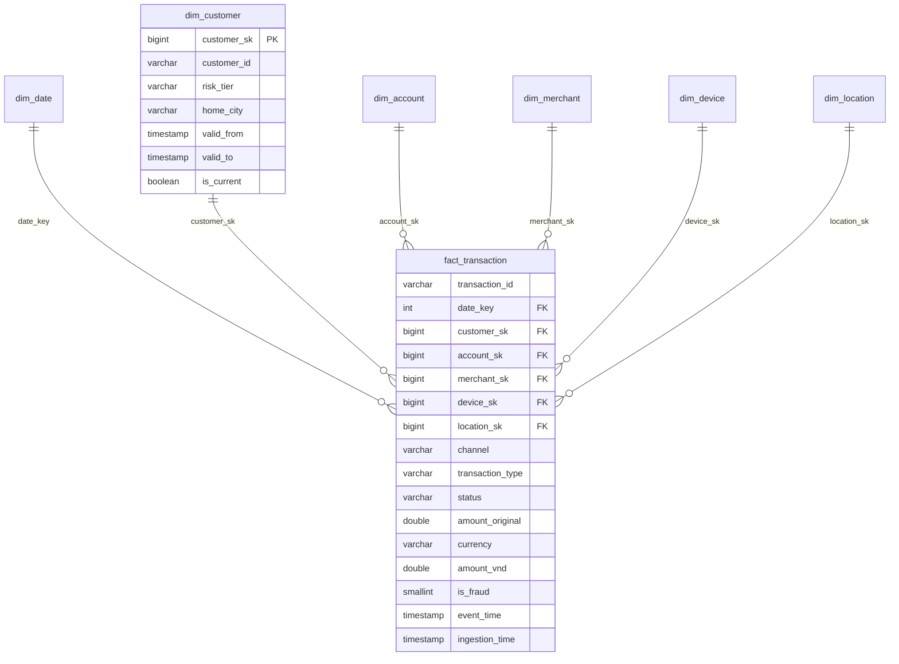

# Grain & Star Schema Design — fact_transaction

Thiết kế mô hình chiều (dimensional model) cho lớp Gold của *Financial Transaction Data Lakehouse*.
Tài liệu này chốt **grain**, **surrogate key**, **chiến lược SCD**, và **chính sách bad/orphan** trước khi
viết transform (Day 6) và build Gold (Day 9). DDL tương ứng: [`sql/star_schema.sql`](../sql/star_schema.sql).

---

## 1. Grain (hạt)

> **1 dòng `fact_transaction` = 1 giao dịch tài chính** (1 `transaction_id` duy nhất — một sự kiện
> thanh toán / chuyển tiền / rút tiền / nạp tiền).

- KHÔNG phải 1 dòng/ngày, KHÔNG phải 1 dòng/khách, KHÔNG phải số dư cuối kỳ.
- Đây là **transaction fact** — grain mịn nhất, cho phép roll-up lên mọi mức (ngày, kênh, KH, merchant).
- Chốt grain trước tiên: mọi dimension và measure phải nhất quán với "một giao dịch".

---

## 2. Bus matrix (tiến trình × chiều)

| Business process | date | customer | account | merchant | device | location |
|---|:--:|:--:|:--:|:--:|:--:|:--:|
| Giao dịch (fact_transaction) | ✅ | ✅ | ✅ | ✅¹ | ✅ | ✅ |

¹ merchant chỉ áp dụng cho giao dịch `payment`/`debit`; `transfer`/`withdrawal`/`topup` không có merchant
→ dùng member **Unknown (sk = -1)** (xem §7).

---

## 3. Chiến lược SCD từng dimension

| Dimension | Grain | SCD | Lý do |
|---|---|---|---|
| **dim_customer** | 1 dòng / **phiên bản** khách hàng | **Type 2** | Có `customer_scd_events` (risk_tier / home_city / phone thay đổi theo thời gian) — cần giữ lịch sử để phân tích đúng theo thời điểm giao dịch |
| dim_account | 1 dòng / account | Type 1 (overwrite) | Thuộc tính ít đổi, không cần lịch sử |
| dim_merchant | 1 dòng / merchant | Type 1 | |
| dim_device | 1 dòng / device | Type 1 | |
| dim_location | 1 dòng / location | Static | Bảng tham chiếu cố định |
| dim_date | 1 dòng / ngày | Static (generate) | Lịch sinh sẵn |

---

## 4. Surrogate key

- Mỗi dimension có khóa thay thế `<dim>_sk` (số nguyên tăng dần, **vô nghĩa nghiệp vụ**) làm **PK**.
- Giữ **business key** gốc (`customer_id`, `account_id`...) trong dimension để truy vết nguồn.
- `fact_transaction` chỉ tham chiếu `*_sk` — **không** tham chiếu business key trực tiếp.
- Lý do:
  1. Tách fact khỏi thay đổi/format khóa nguồn.
  2. **Bắt buộc cho SCD2**: 1 `customer_id` có nhiều phiên bản → mỗi phiên bản 1 `customer_sk` khác nhau;
     fact phải trỏ đúng phiên bản (xem §6).
- Mỗi dimension có sẵn 1 dòng **Unknown** với `sk = -1` cho FK mồ côi / không áp dụng (xem §7).

---

## 5. fact_transaction — cấu trúc cột

| Cột | Vai trò | Ghi chú |
|---|---|---|
| `transaction_id` | **Degenerate dimension** | Khóa nghiệp vụ của giao dịch, giữ thẳng trong fact (không tách dim). Unique trong fact sạch (bản dup đã bị quarantine). |
| `date_key` | FK → dim_date | Lấy từ ngày của `event_time`. |
| `customer_sk` | FK → dim_customer | **Đúng phiên bản** tại `event_time` (SCD2, §6). |
| `account_sk` | FK → dim_account | |
| `merchant_sk` | FK → dim_merchant | -1 nếu giao dịch không có merchant. |
| `device_sk` | FK → dim_device | |
| `location_sk` | FK → dim_location | |
| `channel` | Degenerate | mobile/qr/pos/web/atm — cardinality thấp, giữ thẳng. |
| `transaction_type` | Degenerate | payment/transfer/withdrawal/topup/debit. |
| `status` | Degenerate | success/failed/pending. |
| `amount_original` | Measure | Số tiền theo `currency` gốc — **chỉ additive trong cùng currency**. |
| `currency` | Degenerate | VND/USD/EUR. |
| `exchange_rate` | Measure (non-additive) | Tỷ giá VND/1 đơn vị tại ngày giao dịch (từ exchange_rates). |
| `amount_vnd` | **Measure (fully additive)** | `amount_original × exchange_rate` — quy về VND để cộng được trên mọi chiều. Đây là measure chính. |
| `is_fraud` | Measure (additive) | 0/1 từ `fraud_labels`; `SUM` = số giao dịch gian lận. |
| `fraud_pattern` | Degenerate | Loại pattern (velocity_burst...), NULL nếu không fraud. |
| `event_time` | Timestamp | Thời điểm giao dịch xảy ra. |
| `ingestion_time` | Timestamp | Thời điểm dữ liệu được nạp. |
| `ingestion_lag_seconds` | Measure | `event→ingestion`, phục vụ phân tích trễ / backfill. |

**Additivity** (điểm cần nói rõ): `amount_vnd`, `is_fraud`, `ingestion_lag_seconds` cộng được;
`amount_original` chỉ cộng trong cùng currency; `exchange_rate` không cộng (là tỷ lệ).

---

## 6. SCD2 point-in-time join ⭐

`fact` phải gắn `customer_sk` đúng **phiên bản có hiệu lực tại thời điểm giao dịch**, không phải phiên bản
hiện tại. Khi build Gold (join Silver → dim_customer):

```sql
SELECT f.*, d.customer_sk
FROM silver_transactions f
JOIN dim_customer d
  ON f.customer_id = d.customer_id
 AND f.event_time >= d.valid_from
 AND f.event_time <  d.valid_to;   -- valid_to của dòng hiện hành = '9999-12-31'
```

Ví dụ: KH `cus_000102` đổi `risk_tier` low→high ngày 2026-03-01. Giao dịch ngày 2026-02 phải trỏ phiên bản
`risk_tier=low`; giao dịch ngày 2026-04 trỏ phiên bản `risk_tier=high`. Nhờ vậy phân tích rủi ro theo đúng
trạng thái tại thời điểm giao dịch (không bị "rò rỉ" trạng thái tương lai).

---

## 7. Chính sách bad record & orphan FK

- `fact_transaction` được build từ **Silver (đã làm sạch, Day 6-7)**. Các dòng bad (amount lỗi, timestamp
  lỗi, duplicate, channel/currency sai) đã bị **quarantine**, KHÔNG vào fact.
- FK mồ côi (customer/account/merchant không tồn tại trong dim): trỏ về member **Unknown (`sk = -1`)** thay vì
  loại bỏ — giữ được measure của giao dịch mà vẫn không vỡ join. Mỗi dimension chèn sẵn 1 dòng `sk = -1`.
- merchant không áp dụng (transfer/withdrawal/topup) cũng dùng `merchant_sk = -1`.

---

## 8. dim_date

Generate lịch phủ **2025-12-01 → 2026-07-31** (bao trùm cửa sổ dữ liệu + đệm):

| Cột | Ví dụ |
|---|---|
| `date_key` (PK) | 20260115 (INT YYYYMMDD) |
| `full_date` | 2026-01-15 |
| `year / quarter / month / day` | 2026 / 1 / 1 / 15 |
| `month_name / day_name` | January / Thursday |
| `day_of_week` | 1=Mon … 7=Sun |
| `is_weekend` | day_of_week ≥ 6 |
| `is_payday` | ngày trong {1, 2, 14, 15} (khớp payday bump của generator) |

---

## 9. ERD



---

## 10. Checklist Day 5

- [x] Grain chốt rõ (1 dòng = 1 giao dịch)
- [x] Bus matrix
- [x] Quyết định SCD từng dim (dim_customer = SCD2)
- [x] Surrogate key + Unknown member (-1)
- [x] fact_transaction: degenerate dim + FK + measure (additivity ghi rõ)
- [x] SCD2 point-in-time join documented
- [x] dim_date spec
- [x] DDL: [`sql/star_schema.sql`](../sql/star_schema.sql)
